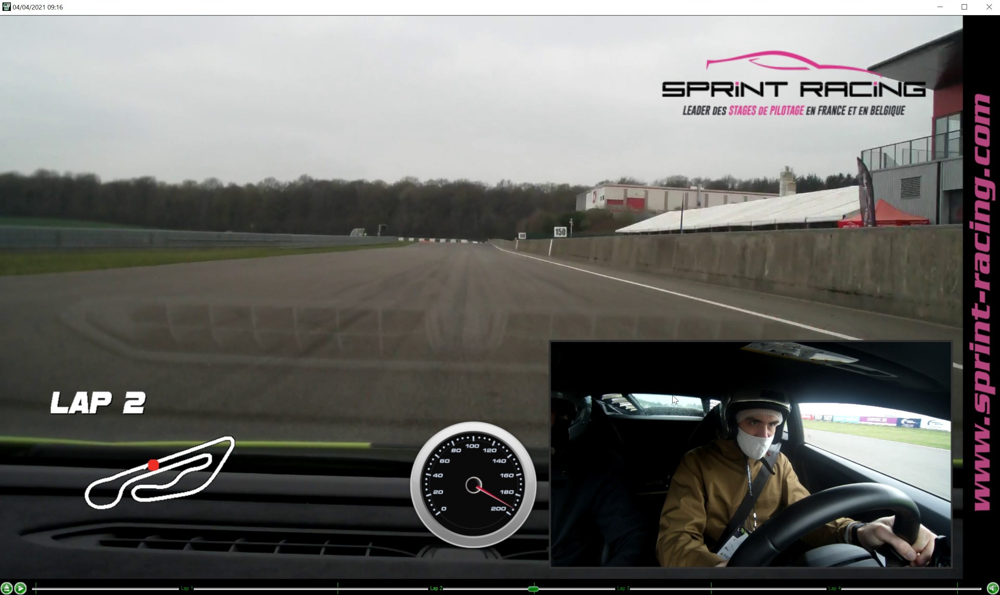
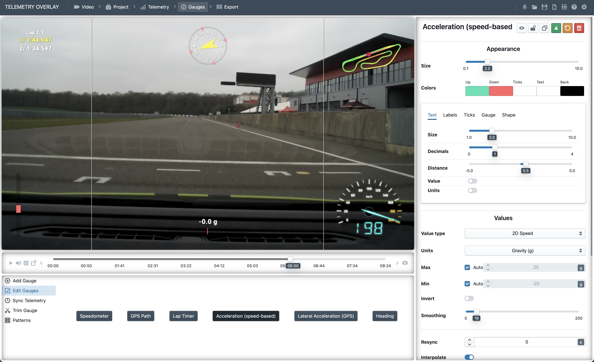

# Race-Keeper RKD Telemetry Extractor

**Extract GPS, accelerometer, and gyroscope data from Race-Keeper `.rkd` telemetry files.**

Race-Keeper "Instant Video" systems (by [Trivinci Systems LLC](https://trivinci.com/), USA) record synchronized video and telemetry at professional track days and racing events. The telemetry is stored in proprietary `.rkd` binary files, readable only with the included Windows-only player.

This project provides:
- **Two independent parser implementations** — Python and Go — producing identical output
- Export to **[Telemetry Overlay](https://goprotelemetryextractor.com/) Custom CSV** (30 Hz)
- Export to **GPX 1.1** for track visualization
- The **first public documentation** of the RKD binary format

## Before & After

The Race-Keeper USB stick comes with a Windows-only video player. If you're on macOS or Linux, you're stuck with raw `.mp4` files and no telemetry.

**Original Race-Keeper player (Windows only):**



**After extracting with this tool and loading into Telemetry Overlay:**



The CSV export gives you full control over which gauges to display, their appearance, and positioning - something the original player doesn't allow.

## Quick Start

### Python (no dependencies)

```bash
cd python
python3 rkd_parser.py outing.rkd              # Export CSV + GPX
python3 rkd_parser.py outing.rkd --info        # Print session summary only
python3 rkd_parser.py --all-in /Volumes/RACEKEEPER/  # Batch process
```

**Requirements:** Python 3.9+ (stdlib only)

### Go (single binary)

```bash
cd go
go build -o rkd-parser .
./rkd-parser outing.rkd                        # Export CSV + GPX
./rkd-parser -info outing.rkd                  # Print session summary only
./rkd-parser -all-in /Volumes/RACEKEEPER/      # Batch process
```

**Requirements:** Go 1.21+ (stdlib only)

Both implementations produce **byte-for-byte identical** CSV and GPX output.

## What You Get

### Telemetry Overlay CSV (30 Hz)
A CSV file ready to load into [Telemetry Overlay](https://goprotelemetryextractor.com/) with:

| Channel | Rate | Source |
|---------|------|--------|
| GPS position (lat/lon) | 30 Hz (interpolated) | GPS receiver |
| Speed (m/s + km/h) | 30 Hz (interpolated) | GPS receiver |
| Altitude (m) | 30 Hz (interpolated) | GPS receiver |
| Heading (deg) | 30 Hz (interpolated) | GPS receiver |
| Vertical speed (ft/min) | 30 Hz (interpolated) | GPS receiver |
| Satellites, GPS fix | 5 Hz | GPS receiver |
| Accelerometer X/Y/Z (m/s²) | 30 Hz | IMU |
| Gyroscope X/Y/Z (deg/s) | 30 Hz | IMU |
| Pitch angle (deg) | 30 Hz | Computed from accelerometer |
| Bank/roll angle (deg) | 30 Hz | Computed from accelerometer |
| Turn rate (deg/s) | 30 Hz | Gyroscope Z axis |
| G-force longitudinal/lateral/total | 30 Hz | Computed from IMU |
| Braking indicator | 30 Hz | Computed from IMU |
| Cumulative distance (km) | 30 Hz | Computed from GPS |

The `utc (ms)` timestamp column enables **automatic sync** with video files in Telemetry Overlay.

### GPX Track File
A standard GPX 1.1 file at native GPS rate (~5 Hz) for:
- Viewing in Google Earth, GPXSee, Strava, etc.
- Verifying the track layout
- Sharing routes

### Session Summary

```
════════════════════════════════════════════════════════════
  RKD Session: outing.rkd
════════════════════════════════════════════════════════════
  File size:      474,563 bytes
  Car ID:         11098

  GPS data:
    Fixes:        1,457
    Duration:     289s (4.8 min)
    Max speed:    156.5 km/h (97.3 mph)
    Distance:     5.03 km (3.12 mi)
    Alt range:    249.9 – 263.7 m
    Satellites:   17 – 19

  IMU data:
    Frames:       8,681
    Accel Z (mean): 9.81 m/s² (expect ~9.81)
════════════════════════════════════════════════════════════
```

## RKD Format Overview

The RKD binary format uses a **PNG-style magic signature** (`\x89RKD\r\n\x1a\n`) followed by a sequential stream of typed records with 10-byte headers:

| Record Type | Data | Rate |
|-------------|------|------|
| HEADER (1) | Config key-value pairs | Once |
| GPS (2) | Position, speed, altitude, heading | 5 Hz |
| ACCEL (7) | 3-axis accelerometer (milli-g) | 30 Hz |
| GYRO (12) | 3-axis gyroscope | 30 Hz |
| PERIODIC (6) | System metrics | ~1 Hz |
| TERMINATOR (0x8001) | Session end marker | Once |

See **[RKD_FORMAT_SPEC.md](RKD_FORMAT_SPEC.md)** for the complete binary format specification.

## Sample Data

The `samples/` directory contains:
- `sample_mettet.rkd` — A truncated RKD file (~50 GPS fixes from Circuit de Mettet)
- `sample_output.csv` — Example Telemetry Overlay CSV export
- `sample_output.gpx` — Example GPX track file

## Project Structure

```
├── python/                # Python implementation
│   ├── rkd_parser.py      #   Parser, exporters, CLI (standalone, no deps)
│   ├── tests/             #   Test suite (77 tests, 100% coverage)
│   ├── pyproject.toml     #   pytest + coverage config
│   └── Makefile           #   install, test, lint, clean
├── go/                    # Go implementation
│   ├── main.go            #   CLI entry point
│   ├── rkd/               #   Parser package
│   ├── go.mod             #   Module config
│   └── Makefile           #   build, test, lint, clean
├── samples/               # Shared test data
│   ├── sample_mettet.rkd  #   Truncated RKD sample
│   ├── sample_output.csv  #   Reference CSV export
│   └── sample_output.gpx  #   Reference GPX export
├── Makefile               # Root: test/lint/build all
├── CLAUDE.md              # Claude Code contribution guidelines
├── RKD_FORMAT_SPEC.md     # Formal binary format specification
├── RESEARCH_NOTES.md      # Reverse-engineering narrative
├── SESSION_LOG.md         # Claude Code interaction log
└── LICENSE                # MIT license
```

## Background

This project was born out of frustration: a macOS user with Race-Keeper track day recordings and no way to use the telemetry data. The proprietary `.rkd` format had no public documentation, and the official tools only run on Windows.

The format was reverse-engineered in a single day using **Claude Code** as a collaborative analysis partner. The full narrative of the reverse-engineering process is documented in [RESEARCH_NOTES.md](RESEARCH_NOTES.md), and the Claude Code session transcripts are referenced in [SESSION_LOG.md](SESSION_LOG.md).

## For Telemetry Overlay Users

If you're here because you want to use Race-Keeper data with [Telemetry Overlay](https://goprotelemetryextractor.com/):

1. Copy your `outing.rkd` file from the USB stick
2. Run: `cd python && python3 rkd_parser.py outing.rkd` (or use the Go binary)
3. Load the generated `.csv` into Telemetry Overlay as a "Custom CSV" data source
4. The UTC timestamps will auto-sync with your video

## For Developers

The format specification in [RKD_FORMAT_SPEC.md](RKD_FORMAT_SPEC.md) is designed to be implementor-friendly, with:
- Exact byte offsets and struct formats
- Unit conversion formulas with examples
- Validation checksums for testing
- Example hex dumps

The Python parser (`python/rkd_parser.py`) serves as a reference implementation — it's deliberately written to be readable with extensive inline comments explaining each binary format detail. The Go implementation (`go/`) is a direct port that produces identical output.

## Limitations

- **No OBD-2 data support yet.** Race-Keeper systems [support OBD-II](https://www.race-keeper.com/product/race-keeper-obdii-scanner/) for logging engine RPM, throttle position, coolant temperature, and more. The `.rkd` format includes OBD-2 record types, but the recordings used for reverse-engineering did not have an OBD-II scanner connected (the header log showed "no connection to OBD2"). PRs with sample `.rkd` files that include OBD-2 data are very welcome — this would allow implementing support for those channels.

## Contributing

Found a Race-Keeper system with different record types or data structures? Contributions welcome:
- Open an issue with a hex dump of the first 256 bytes
- If possible, share a sample `.rkd` file (or the record type summary from `--info`)
- **Especially wanted:** `.rkd` files with OBD-2 data for testing and implementation

## Credits

- **Reverse engineering & implementation:** [@sam-dumont](https://github.com/sam-dumont)
- **AI-assisted analysis:** [Claude Code](https://claude.ai/claude-code) (Anthropic)

## License

MIT License — see [LICENSE](LICENSE)

This project is the result of independent reverse engineering. It is not affiliated with, endorsed by, or connected to Race-Keeper or Trivinci Systems LLC.
